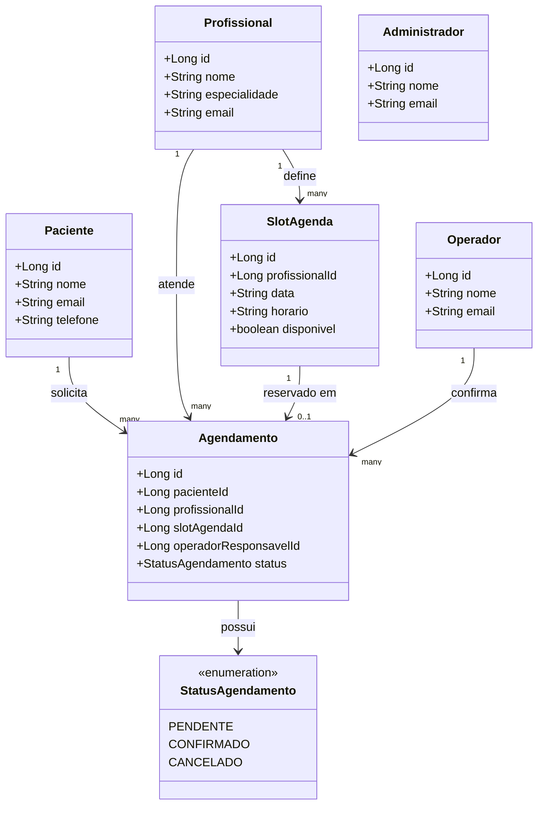

# Diagrama de Classes — Sistema de Clínica (ZenConsulta)

> Este diagrama foi reconstruído a partir dos documentos de requisitos (RF/RN),
> Épicos e Histórias de Usuário do projeto, já que o diagrama original não foi
> localizado. Ele reflete exatamente as entidades e campos implementados no
> código desta entrega (P1).

Cole o bloco abaixo em https://mermaid.live para visualizar/editar, ou deixe
aqui mesmo no repositório (o GitHub renderiza blocos ```mermaid automaticamente
em arquivos .md).



## Justificativa das relações

| Relação | Motivo (RF/RN) |
|---|---|
| `Profissional -> SlotAgenda` | RF01: profissional define seus horários |
| `Paciente -> Agendamento` | RF04/RN04: paciente solicita agendamentos |
| `Profissional -> Agendamento` | RF09: todo agendamento é vinculado a um profissional |
| `SlotAgenda -> Agendamento` (0..1) | RF09/RN02: um slot vira "ocupado" por no máximo 1 agendamento confirmado por vez |
| `Operador -> Agendamento` | RF06/RF12/RN03: operador confirma e fica registrado como responsável |
